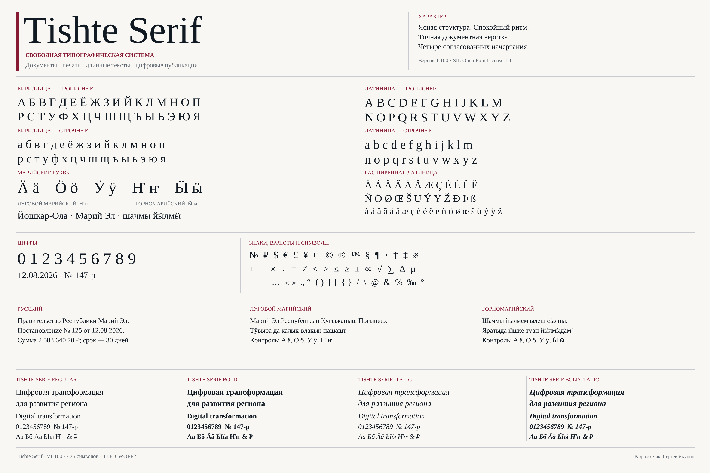
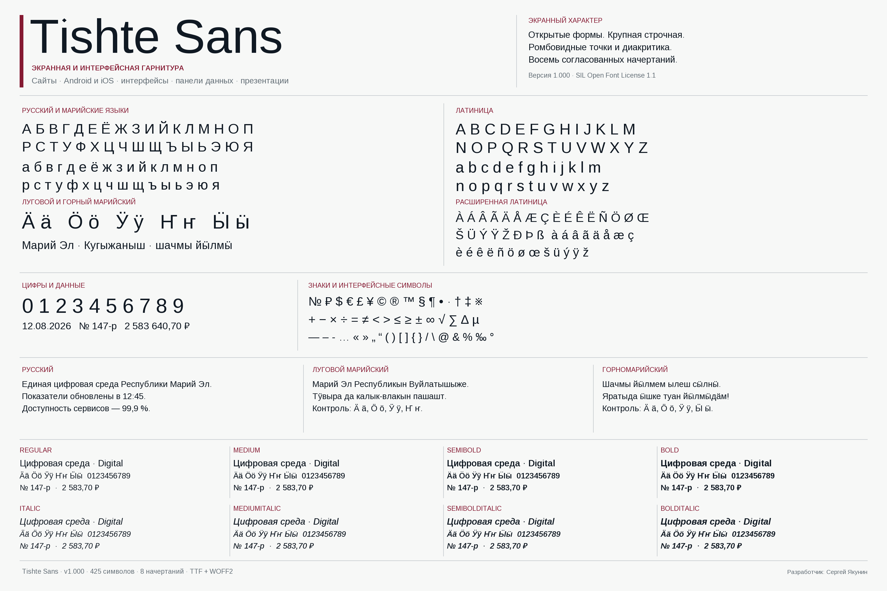

# Tishte

**Сделано в Республике Марий Эл**

[](https://yasg1988.github.io/tishte-fonts/)
[](https://www.npmjs.com/package/@yasg1988/tishte-fonts)
[](https://github.com/yasg1988/tishte-fonts/releases/latest)
[](https://github.com/yasg1988/tishte-fonts/actions/workflows/publishing.yml)
[](LICENSE.txt)





Свободная типографическая система с поддержкой русского, лугового марийского,
горномарийского языков и расширенной латиницы. Версия `1.100` включает две
гарнитуры и 14 статических начертаний в TTF и WOFF2.

## Семейства

**Tishte Serif** — документная антиква, метрически совместимая с Times New
Roman. Четыре начертания: Regular, Bold, Italic и Bold Italic. Совпадение ширин,
парных корректировок и вертикальных метрик позволяет заменять шрифт в готовых
документах без изменения переносов строк и пагинации.

**Tishte Sans** — экранный гротеск для сайтов, приложений, презентаций,
дашбордов и навигации. Десять начертаний: Regular, Italic, Medium,
Medium Italic, SemiBold, SemiBold Italic, Bold, Bold Italic, ExtraBold и
ExtraBold Italic. У него свободные
экранные метрики, табличные цифры, единая ширина математических операторов и
оптимизированная для современных растеризаторов структура.

В каждом файле 425 кодовых точек: русская кириллица, буквы лугового марийского
(`Ӓ ӓ, Ӧ ӧ, Ӱ ӱ, Ҥ ҥ`) и горномарийского (`Ӓ ӓ, Ӧ ӧ, Ӱ ӱ, Ӹ ӹ`),
Latin Extended-A, цифры, валюты, пунктуация, математические и документные
знаки. TTF предназначены для настольных и мобильных приложений, WOFF2 — для
веба.

## Установка

Скачайте нужный ZIP на странице
[Releases](https://github.com/yasg1988/tishte-fonts/releases) и распакуйте его.

### Windows 10 и 11

1. Откройте папку `fonts/ttf`.
2. Выделите TTF-файлы, нажмите правой кнопкой и выберите **Установить** или
   **Установить для всех пользователей**.
3. Перезапустите уже открытые приложения.

Для установки в профиль текущего пользователя в архивах есть скрипты
`tools/Install-TishteSerif.ps1` и `tools/Install-TishteSans.ps1`; рядом лежат
соответствующие скрипты удаления.

### macOS

Откройте TTF-файлы, нажмите **Установить шрифт** в приложении «Шрифты», затем
перезапустите приложения, которые были открыты во время установки.

### Linux

```bash
mkdir -p ~/.local/share/fonts/Tishte
cp fonts/ttf/*.ttf ~/.local/share/fonts/Tishte/
fc-cache -f
```

### Android

Отдельный формат для Android не нужен: приложения используют обычные TTF.
Скопируйте файлы в `app/src/main/res/font/`, переименовав их в нижний регистр,
например `tishte_sans_regular.ttf`.

```kotlin
val TishteSans = FontFamily(
    Font(R.font.tishte_sans_regular, FontWeight.Normal),
    Font(R.font.tishte_sans_medium, FontWeight.Medium),
    Font(R.font.tishte_sans_semibold, FontWeight.SemiBold),
    Font(R.font.tishte_sans_bold, FontWeight.Bold),
    Font(R.font.tishte_sans_extrabold, FontWeight.ExtraBold),
)
```

Для документного текста аналогично добавьте файлы Tishte Serif. Системная
замена шрифта на всём устройстве стандартным Android API не поддерживается.

### iOS и iPadOS

Добавьте TTF в проект Xcode, включите имена файлов в массив `UIAppFonts` файла
`Info.plist` и обращайтесь к семействам `Tishte Serif` или `Tishte Sans`.

### Веб

Скопируйте содержимое `fonts/web` на сервер и подключите нужную таблицу стилей:

```html
<link rel="stylesheet" href="/fonts/tishte-sans-v1100.css">
<link rel="stylesheet" href="/fonts/tishte-serif-v1100.css">
```

```css
body { font-family: "Tishte Sans", sans-serif; }
article { font-family: "Tishte Serif", serif; }
```

### npm

```bash
npm install @yasg1988/tishte-fonts
```

Подключите обе гарнитуры либо только нужную:

```js
import "@yasg1988/tishte-fonts";
import "@yasg1988/tishte-fonts/serif.css";
import "@yasg1988/tishte-fonts/sans.css";
```

## Сборка и проверка

Требуются Python 3.12+, FontForge, OpenType Sanitizer и зависимости из
`requirements-lock.txt`.

```powershell
# Tishte Serif
python scripts/build_release.py --version 1.100
python scripts/audit_reproducible_build.py --version 1.100
python scripts/audit_metric_contract.py --version 1.100
python scripts/audit_unicode_normalization.py --version 1.100
python scripts/audit_language_corpus.py --version 1.100
python scripts/audit_opentype.py --version 1.100
python scripts/audit_document_layout.py --version 1.100
python scripts/audit_outline_originality.py --version 1.100 --max-identical-ratio 0.01
python scripts/audit_legal_metadata.py --version 1.100
python scripts/audit_source_metadata.py
python scripts/run_fontbakery.py --version 1.100

# Tishte Sans
python scripts/build_sans_release.py --version 1.100
python scripts/audit_sans_reproducible.py --version 1.100
python scripts/audit_sans.py --version 1.100
python scripts/audit_sans_raster.py --version 1.100
python scripts/audit_sans_originality.py --version 1.100 --max-identical-ratio 0.01
python scripts/run_sans_fontbakery.py --version 1.100

# Общий контракт и дистрибутивы
python scripts/audit_superfamily.py --version 1.100
python scripts/build_distribution.py --version 1.100
python scripts/build_sans_distribution.py --version 1.100
python scripts/audit_distribution.py dist/Tishte-Serif-v1.100.zip
python scripts/audit_distribution.py dist/Tishte-Sans-v1.100.zip
```

Редактируемые исходники Serif находятся в `sources/tishte-serif`. Sans
воспроизводимо строится из закреплённой версии свободного Arimo с собственными
преобразованиями Tishte. Сборка проверяется в GitHub Actions на Linux, Windows
и macOS.

### Подготовка для Google Fonts

Отдельный сборочный контур создаёт две независимые папки для ревью Google
Fonts, не изменяя обычные релизные файлы:

```powershell
python scripts/fetch_sans_upstream.py
python scripts/build_googlefonts.py --version 1.100
python scripts/audit_googlefonts.py
```

Результат сохраняется в `build/googlefonts/ofl/tishteserif` и
`build/googlefonts/ofl/tishtesans`. Требования к окружению, структура пакетов и
оговорки по статическим семействам описаны в [googlefonts/README.md](googlefonts/README.md).

### Пакет для офисных продуктов

Единый комплект для технической и лицензионной оценки в офисных продуктах
строится непосредственно из официальных релизных ZIP v1.100:

```powershell
python scripts/build_partner_submission_kit.py --version 1.100
python scripts/audit_partner_submission_kit.py --version 1.100
```

Маршруты подачи, порядок работы и шаблоны обращений описаны в
[docs/office-suite-submissions.md](docs/office-suite-submissions.md).

## Лицензия и происхождение

Tishte распространяется по [SIL Open Font License 1.1](LICENSE.txt). Шрифт
можно бесплатно использовать, встраивать, изучать, изменять и распространять
на условиях OFL. Документы, созданные с его помощью, лицензией шрифта не
ограничиваются.

Tishte Serif является модифицированной версией Tinos, Tishte Sans —
модифицированной версией Arimo. Сведения об исходных проектах и лицензии
сохранены в [THIRD_PARTY_NOTICES.md](THIRD_PARTY_NOTICES.md) и метаданных
файлов.
